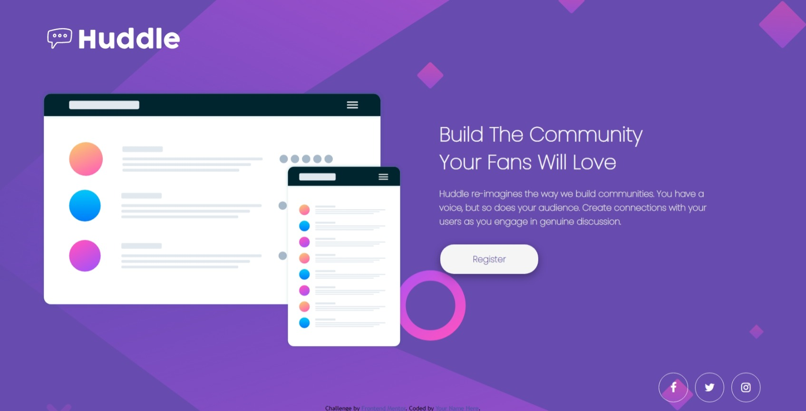

# Frontend Mentor - Huddle landing page with single introductory section solution

This is a solution to the [Huddle landing page with single introductory section challenge on Frontend Mentor](https://www.frontendmentor.io/challenges/huddle-landing-page-with-a-single-introductory-section-B_2Wvxgi0). Frontend Mentor challenges help you improve your coding skills by building realistic projects.

## Table of contents

- [Overview](#overview)
  - [The challenge](#the-challenge)
  - [Screenshot](#screenshot)
  - [Links](#links)
- [My process](#my-process)
  - [Built with](#built-with)
  - [What I learned](#what-i-learned)
- [Author](#author)

**Note: Delete this note and update the table of contents based on what sections you keep.**

## Overview

### The challenge

Users should be able to:

- View the optimal layout for the page depending on their device's screen size
- See hover states for all interactive elements on the page

### Screenshot



### Links

- Solution URL: [Solution URL](https://github.com/Codedzephyr/Hubble-landing-page-with-single-introductory-section)
- Live Site URL: [Live Site URL](https://optimistic-pike-b602f6.netlify.app/)

## My process

### Built with

- Semantic HTML5 markup
- CSS custom properties
- Flexbox
- CSS Grid
- Mobile-first workflow

### What I learned

```html
<div class="social-media">
  <a href="#" class="fa fa-facebook"></a>
  <a href="#" class="fa fa-twitter"></a>
  <a href="#" class="fa fa-instagram"></a>
</div>
```

```css
body {
  max-width: 100%;
  background-image: url(./images/bg-desktop.svg);
  background-position: center;
  background-size: cover;
  background-repeat: no-repeat;
  background-color: hsl(257, 40%, 49%);
}
```

## Author

- Website - [Salihu Andulhamid](https://infallible-pike-a0b433.netlify.app/)
- Frontend Mentor - [@Codedzephyr](https://www.frontendmentor.io/profile/Codedzephyr)
- Twitter - [@dimah](https://www.twitter.com/_dimah__)
